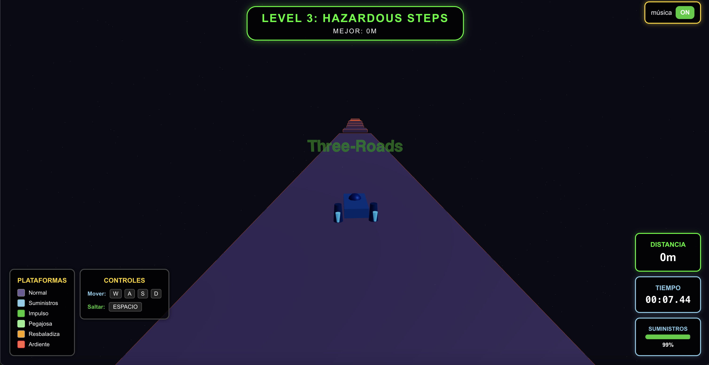

# Three Roads

**Three Roads** is an immersive 3D racing/runner game built with modern web technologies. Navigate your ship through a dynamic environment, avoid obstacles, and survive as long as possible in this high-speed challenge.



## 🚀 Features

-   **3D Graphics**: Powered by [React Three Fiber](https://docs.pmnd.rs/react-three-fiber) and [Three.js](https://threejs.org/) for performant and declarative 3D scenes.
-   **Physics Engine**: Realistic physics interactions using [Cannon.js](https://github.com/pmndrs/use-cannon) (via `@react-three/cannon`).
-   **ECS Architecture**: Built on a custom Entity Component System (ECS) for scalable and decoupled game logic.
-   **Reactive State**: Game state management handled by [Zustand](https://github.com/pmndrs/zustand) for high-performance updates.
-   **Content & Progression**:
    -   **21 Challenging Levels**: Expanded content with increasing difficulty.
    -   **Level Selector**: Navigate through levels with a paginated interface.
    -   **High Score Tracking**: Persistent high scores for each level.
-   **Dynamic Gameplay**:
    -   Procedural track generation.
    -   Interactive ship controls with visual feedback.
    -   Real-time HUD displaying distance and score.
    -   Crash detection and game over states.

## 🎮 Controls

Take command of your ship using the keyboard:

| Action | Key 1 | Key 2 |
| :--- | :---: | :---: |
| **Steer Left** | `A` | `←` (Left Arrow) |
| **Steer Right** | `D` | `→` (Right Arrow) |
| **Accelerate** | `W` | `↑` (Up Arrow) |
| **Brake / Reverse** | `S` | `↓` (Down Arrow) |
| **Jump** | `Space` | - |

## 🛠️ Installation & Running

1.  **Clone the repository:**
    ```bash
    git clone <repository-url>
    cd three_roads
    ```

2.  **Install dependencies:**
    ```bash
    npm install
    ```

3.  **Start the development server:**
    ```bash
    npm start
    ```
    Open [http://localhost:3000](http://localhost:3000) to view it in your browser.

## 🏗️ Project Structure

The project follows a component-based architecture mixed with ECS patterns:

-   **`src/components/`**: React components for rendering the 3D scene (Ship, Track, Obstacles) and UI (HUD, CrashOverlay).
-   **`src/ecs/`**: Core game logic.
    -   **`components/`**: Data containers (e.g., `Transform`, `Physics`, `Input`).
    -   **`systems/`**: Logic processors (e.g., `MovementSystem`, `CollisionSystem`, `InputSystem`).
    -   **`entities/`**: Entity definitions and factories.
    -   **`GameManager.js`**: Orchestrates the game loop and ECS initialization.
-   **`src/store/`**: Global state management stores.

## 🤝 Contributing

Contributions are welcome! Please feel free to submit a Pull Request.

## 📄 License

This project is open source and available under the [MIT License](LICENSE).
